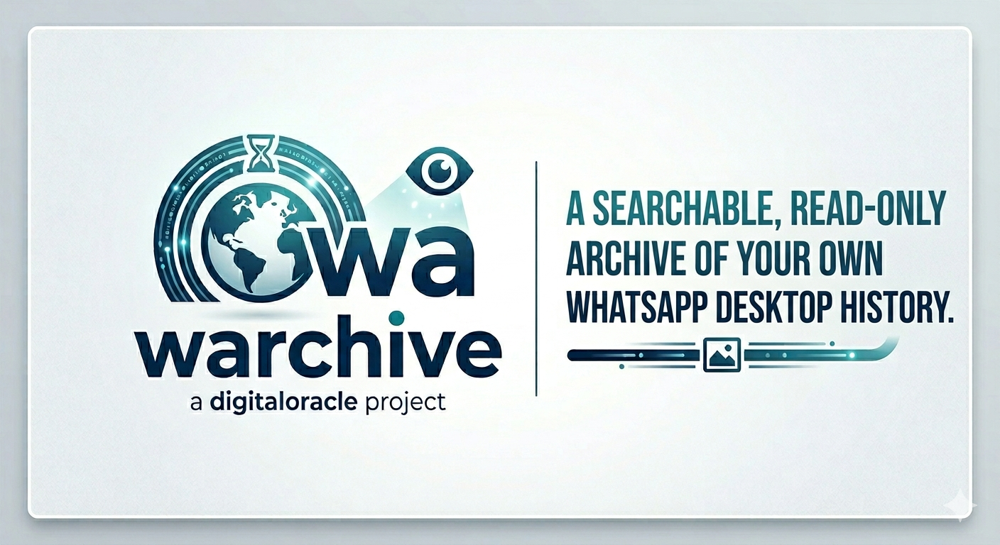

<p align="center">
  
</p>

# warchive — read your own WhatsApp Desktop history from the command line

`warchive` searches and reads your **WhatsApp Desktop for Windows** chat history
directly from the app's encrypted local database — no QR code, no linked-device
pairing, no proxy, no browser automation. It recovers the database key from the
running app's memory, decrypts the SQLite database read-only, and gives you fast
keyword search, date filters, contact resolution, and exports. It also ships an
MCP server so Claude Desktop can query your chats.

> ### At a glance
> - 🪟 **Windows only.** Uses Windows process-memory APIs (`ReadProcessMemory`,
>   `VirtualQueryEx`).
> - 🟢 **Needs WhatsApp Desktop running** (the Microsoft Store / UWP app) with at
>   least one chat loaded — that's how the key is recovered. After the first run
>   the data is cached locally and queries work even with WhatsApp closed.
> - 👁️ **Strictly read-only.** It never writes to, modifies, or sends anything
>   through WhatsApp. It opens the database files for reading and decrypts in
>   memory.
> - 🔑 **No authentication, no QR code, no proxy.** It does not pair as a linked
>   device or man-in-the-middle the WhatsApp protocol. It reads data that is
>   already on your machine.

## ⚖️ Disclaimer

This tool is for accessing **your own** WhatsApp data on **your own** device —
personal archival, search, and digital-forensics/research use. Reading other
people's private messages without authorization is illegal in most
jurisdictions. You are responsible for complying with the laws that apply to
you and with WhatsApp's terms. Provided "as is", without warranty (see
[LICENSE](LICENSE)). The license year/holder are placeholders — update them
before publishing.

## Features

- **Hybrid search** — lexical full-text (SQLite FTS5 + BM25, with Hebrew-aware
  normalization and prefix/suffix stemming) fused via Reciprocal Rank Fusion with
  **local semantic vector search** for paraphrase and cross-lingual Hebrew↔English
  matches. Modes: `hybrid` (default), `lexical`, `semantic`. Semantic is optional
  and degrades gracefully when its extras aren't installed.
- **Filters:** by contact (display name, phone, or LID), by date range, by
  direction (`--mine` / `--theirs`), top-N. `--context N` shows messages around
  each hit; `--recency` favors newer matches.
- **Sender direction** (`sent` / `received`) for ~half of messages, recovered
  from the WhatsApp IndexedDB LevelDB store.
- **Exports:** JSON, CSV, a styled HTML transcript, or token-efficient one-line
  compact output (handy for piping into an LLM).
- **Fast:** after the first decrypt, a plaintext mirror serves queries in well
  under a second and works even when WhatsApp is closed.
- **MCP server** (`wa_mcp.py`) for Claude Desktop, dependencies contained by uv.

## Install (CLI)

Requires Python 3.10+ on Windows.

```powershell
pip install -r requirements.txt
```

Only `cryptography` is strictly required; `python-bidi` (RTL display) and
`python-snappy` (sender-direction support) are recommended.

## First run

WhatsApp Desktop must be **running with at least one chat open**. The first run
scans the WhatsApp process memory for the database key (~60–90 s) and caches it
in `.env`. Every run after that is instant and works even if WhatsApp is closed.

```powershell
python wa_search.py --list-chats
```

## Usage

```powershell
# Keyword search (BM25-ranked, Hebrew-aware)
python wa_search.py "pizza"

# One contact — by phone, partial display name, or LID fragment
python wa_search.py --phone +15551234567
python wa_search.py --chat "Alice"

# Date range (inclusive, YYYY-MM-DD)
python wa_search.py --chat "Alice" --since 2026-01-01 --until 2026-01-31

# Token-efficient one-line-per-message output
python wa_search.py "apartment" --chat "Alice" --top-k 30 --compact

# Exports
python wa_search.py --chat "Alice" --json > alice.json
python wa_search.py --chat "Alice" --csv  > alice.csv
python wa_search.py --chat "Alice" --html > alice.html

# List all chats by message count (with last-message time)
python wa_search.py --list-chats

# Search modes & retrieval options
python wa_search.py "renting an apartment" --mode semantic   # meaning, cross-lingual
python wa_search.py "pizza" --mode lexical                   # exact/keyword (Hebrew-aware)
python wa_search.py "pizza" --mine                           # only messages you sent
python wa_search.py "pizza" --context 2                      # 2 messages of context each side
python wa_search.py "pizza" --recency                        # favor newer matches
```

Run `python wa_search.py -h` for all flags.

> **Search modes.** `--mode hybrid` (default) fuses keyword (FTS5/BM25, with
> Hebrew normalization + stemming) and semantic vector search via Reciprocal Rank
> Fusion. `--mode semantic` finds matches by meaning (paraphrases, Hebrew↔English);
> `--mode lexical` is exact keyword only. Semantic search needs the optional
> embedding extras (`fastembed`, `sqlite-vec`, `numpy`); without them, the tool
> stays in lexical mode automatically. The MCP server bundles those extras, so
> Claude Desktop always gets full hybrid search.

## How it works (key recovery, salt, and decryption)

WhatsApp for Windows is a UWP app. Its data lives under
`…\Packages\5319275A.WhatsAppDesktop_…\LocalState\sessions\<SESSION_HASH>\`, where
`SESSION_HASH = SHA1(clientKey)`. Messages are in `genericStorage.db`, encrypted
with **SQLite SEE using AES-256 in OFB mode**.

### 1. Getting the decryption key

There are two routes; this tool uses the second.

**The full key chain (the "proper" derivation):**

```
Windows DPAPI-NG
  └─▶ session.db AES key
        └─▶ decrypt session.db → clientKey (48 bytes)
              └─▶ SHA1(clientKey) names the session directory
                    └─▶ (ODUID via clipc.dll) + clientKey
                          └─▶ PBKDF2 → nativeSettings.db key
                                └─▶ row 1 → genericStorage.db key (messages)
                                    row 2 → contacts.db key
```

The catch: the device-unique ID (`GetOfflineDeviceUniqueID`) is only obtainable
from inside the app's UWP container, so this chain can't be completed from an
ordinary process.

**The shortcut this tool uses — recover the key from process memory.** Once
WhatsApp has opened its databases, the raw 32-byte AES keys are sitting in the
app's heap. The tool walks all committed, readable memory regions of the running
WhatsApp process and, for each 8-byte-aligned 32-byte candidate, tries to decrypt
**page 1** of the target database and checks for the `"SQLite format 3\0"` magic.
An entropy pre-filter skips obvious non-keys (too many zero bytes / too few
distinct bytes). Both the message-DB key and the contacts-DB key are found in a
single pass in ~60–90 seconds, then cached to `.env`.

### 2. The page IV / nonce ("salt")

Each 4096-byte page is encrypted independently. The per-page IV is:

```
IV = [page number as 4-byte little-endian] ++ [last 12 bytes of the encrypted page]
```

Those last 12 bytes are a per-page nonce stored in plaintext at the tail of every
page — effectively a per-page salt. **Page 1 is special:** bytes `0x10–0x17` (the
SQLite header fields) are stored unencrypted, so after decrypting page 1 they must
be restored from the ciphertext, and *only* for page 1 — applying that fixup to
other pages corrupts their cell pointers.

### 3. The WAL salt (and a subtle data-loss bug)

WhatsApp keeps the DB in WAL (write-ahead-log) mode. A WAL is **not truncated**
when SQLite checkpoints it — instead the WAL header's *salt* changes and new
frames are written from the top, leaving stale frames from older generations in
the tail of the file. Each frame header carries the salt of the generation that
wrote it (frame bytes `8:16`); a frame belongs to the current generation only if
that salt equals the WAL header salt (header bytes `16:24`).

Replay therefore **must stop at the first frame whose salt doesn't match** — just
as SQLite does. Skipping this check makes an old commit frame in the stale tail
clobber live pages and truncate the database to a weeks-old snapshot, so recent
messages silently vanish. `warchive` validates the salt and only replays the current
generation.

### 4. Reading and caching

The decrypted pages are walked with a small custom SQLite B-tree reader (so the
WAL doesn't need to be checkpointed into a file), the `message` table is read, and
the fully-resolved result is cached in a plaintext SQLite mirror (`wa_mirror.db`).
The mirror is rebuilt only when the source changes (detected via file
mtime/size), so warm queries touch nothing encrypted and need no admin rights.

Full details — B-tree layout, WAL reconstruction, LID/phone resolution, and the
sender-direction extraction from LevelDB — are in **[DECRYPTION.md](DECRYPTION.md)**.

## MCP mode (Claude Desktop)

Claude Desktop runs skills/code in a sandbox that can't reach the running
WhatsApp process. `wa_mcp.py` is an MCP server that runs as a normal host process
(outside the sandbox) and exposes the same search as tools: `search_messages`,
`list_chats`, `refresh_cache`, `wa_status`.

Dependencies are contained by [uv](https://docs.astral.sh/uv/) via PEP 723 inline
metadata — no global installs. Lock them once with `uv lock --script wa_mcp.py`,
then add the server to your Claude Desktop config. **The config path depends on
the install:**

- **Microsoft Store / packaged build:**
  `…\AppData\Local\Packages\Claude_<hash>\LocalCache\Roaming\Claude\claude_desktop_config.json`
- **Standalone installer:** `%APPDATA%\Claude\claude_desktop_config.json`

```json
{
  "mcpServers": {
    "whatsapp": {
      "command": "C:\\path\\to\\uv.exe",
      "args": ["run", "--script", "C:\\path\\to\\warchive\\wa_mcp.py"],
      "cwd": "C:\\path\\to\\warchive"
    }
  }
}
```

Use absolute paths (Claude Desktop doesn't inherit your PATH). Restart Desktop,
then ask it to *"search my WhatsApp for …"*. If a tool errors, ask it to run
`wa_status` first — it reports whether WhatsApp is reachable without rebuilding.

### GPU embeddings (optional)

**By default, embeddings run on CPU — this works identically on NVIDIA, AMD, and
no-GPU machines, and a fresh `pip install`/`uv run` never pulls any GPU package.**
GPU is strictly opt-in and only accelerates the *one-time* full index build (with
incremental updates, the ongoing cost is already trivial).

To use a GPU you install a GPU-enabled `onnxruntime` **yourself** (it is never a
project dependency, because the right build is vendor- and OS-specific and the
wrong one would break other setups), then pass `--gpu` (auto-detect) or
`--directml`:

| Your GPU | Install (into the env that runs embeddings) | Then run with |
|---|---|---|
| Any GPU on Windows (AMD / NVIDIA / Intel) | `pip install onnxruntime-directml` | `--gpu` or `--directml` |
| NVIDIA (CUDA) | `pip install onnxruntime-gpu` | `--gpu` |

On Windows + AMD (e.g. a Radeon RX 7900 XTX), **DirectML** is the path — it runs
the ONNX model on any DirectX 12 GPU and ships as a normal pip wheel (no ROCm
toolchain or Linux-only wheels needed). Note `onnxruntime-directml` replaces the
stock CPU `onnxruntime` in that environment (same `onnxruntime` import, with the
DirectML provider added).

```powershell
python wa_search.py --refresh --gpu     # build/refresh the index on the GPU
```

For the MCP server (which uses `uv`), don't edit the committed deps — layer the
GPU runtime in at launch so the default stays portable. In your Desktop config:

```jsonc
"args": ["run", "--with", "onnxruntime-directml",
         "--script", "C:\\path\\to\\warchive\\wa_mcp.py", "--gpu"]
// or set "env": { "WA_GPU": "1" }
```

If no GPU-enabled `onnxruntime` is present, `--gpu`/`--directml` log a one-line
notice and **fall back to CPU — nothing breaks**. `wa_status` reports the active
providers.

## Repository layout

| Path | What |
|---|---|
| `wa_search.py` | the CLI tool + shared query API |
| `wa_normalize.py` | Unicode/Hebrew normalization + stemming (stdlib) |
| `wa_embed.py` | local semantic embedding index (optional, via uv) |
| `wa_translit.py` | Hebrew↔Latin transliteration / query expansion (stdlib) |
| `wa_mcp.py` | MCP server flavor for Claude Desktop (run via uv) |
| `wa_mcp.py.lock` | uv lockfile for the MCP server's dependencies |
| `DECRYPTION.md` | full technical write-up |
| `CHANGELOG.md` | history |
| `reference/` | attribution for the prior work this builds on |

## Inspiration & acknowledgements

- Inspired by **[openclaw/wacrawl](https://github.com/openclaw/wacrawl)**.
- The UWP decryption approach builds on **ZAPiXDESK** by Alberto Magno
  (kraftdenker) — <https://github.com/kraftdenker/ZAPiXDESK> — and the research
  paper *"Analyzing the Web and UWP versions of WhatsApp for digital forensics"*
  (Forensic Science International: Digital Investigation, Vol. 52, 2025). See
  [`reference/README.md`](reference/README.md) for full attribution.

## Privacy note

Your recovered keys (`.env`), the message cache (`wa_mirror.db`), the contact
cache, and all research artifacts are **git-ignored** and must never be
committed — they are the keys to, and a copy of, your message history. Keep them
local.
